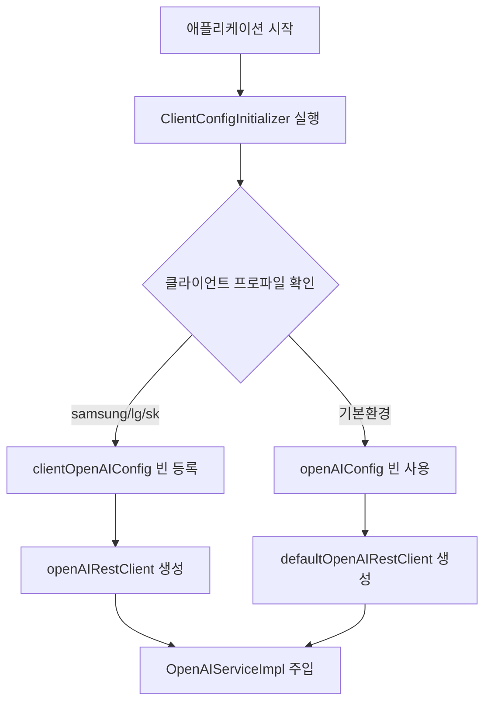

# 클라이언트별 부트스트래핑 설정 가이드

## 개요
부트스트래핑(Bootstrapping) 방식을 사용하여 **애플리케이션 시작 시점**에 클라이언트별로 다른 OpenAI 설정을 동적으로 로드합니다.

## 부트스트래핑이란?

**부트스트래핑**은 Spring 애플리케이션이 시작될 때 컨텍스트가 완전히 로드되기 전에 빈을 동적으로 등록하는 방식입니다.

### 기존 방식 vs 부트스트래핑

| 구분 | 기존 방식 | 부트스트래핑 방식 |
|------|----------|-----------------|
| **빈 등록 시점** | 컨텍스트 로드 후 | 컨텍스트 로드 **전** |
| **설정 결정 시점** | 컴파일/빌드 시 | **런타임 시** |
| **클라이언트 구분** | 별도 빌드 필요 | **단일 빌드**로 모든 클라이언트 지원 |
| **유연성** | 제한적 | **매우 높음** |

## 사용 방법

### 1. 삼성 클라이언트로 실행
```bash
./gradlew bootRun --args='--spring.profiles.active=samsung'
```

### 2. LG 클라이언트로 실행
```bash
./gradlew bootRun --args='--spring.profiles.active=lg'
```

### 3. SK 클라이언트로 실행
```bash
./gradlew bootRun --args='--spring.profiles.active=sk'
```

### 4. 환경변수로 클라이언트 지정
```bash
CLIENT_NAME=samsung ./gradlew bootRun
```

## 구현 아키텍처

### 1. 핵심 컴포넌트

#### `ClientConfigInitializer`
```kotlin
class ClientConfigInitializer : ApplicationContextInitializer<ConfigurableApplicationContext>
```
- **역할**: 애플리케이션 시작 시 클라이언트별 OpenAI 설정 동적 생성
- **등록**: `META-INF/spring.factories`를 통해 자동 등록
- **실행 시점**: Spring 컨텍스트 로드 **이전**

#### `OpenAIConfiguration`
```kotlin
@Configuration
class OpenAIConfiguration {
    @Bean
    @ConditionalOnBean(name = ["clientOpenAIConfig"])
    fun openAIRestClient(@Qualifier("clientOpenAIConfig") openAIConfig: OpenAIConfig)

    @Bean
    @ConditionalOnBean(name = ["openAIConfig"])
    fun defaultOpenAIRestClient(openAIConfig: OpenAIConfig)
}
```
- **역할**: 조건부로 `RestClient` 빈 생성
- **우선순위**: `clientOpenAIConfig` > `openAIConfig`

#### `OpenAIConfig`
```kotlin
@Component
@ConfigurationProperties(prefix = "openai")
data class OpenAIConfig(...)
```
- **역할**: 기본 설정값 제공 (폴백용)

### 2. 빈 등록 플로우



### 3. 설정 우선순위

1. **부트스트래핑 설정** (최우선): `ClientConfigInitializer`에서 동적 생성
2. **프로파일별 설정**: `application.yml`의 프로파일 섹션
3. **기본 설정**: `application.yml`의 기본 섹션

## 클라이언트별 특징

### Samsung
- 모델: `gpt-4-turbo`
- 포트: `8080`
- 로깅: `DEBUG`

### LG
- 모델: `gpt-3.5-turbo`
- 포트: `8081`
- 로깅: `INFO`

### SK
- 모델: `gpt-4`
- 포트: `8082`
- 로깅: `WARN`

## 새 클라이언트 추가하기

### Step 1: ClientConfigInitializer 수정
```kotlin
private fun createClientSpecificConfig(clientName: String, environment: Environment): OpenAIConfig {
    return when (clientName.lowercase()) {
        // 기존 클라이언트들...
        "hyundai" -> OpenAIConfig(  // 새 클라이언트 추가
            apiKey = environment.getProperty("clients.hyundai.openai.api-key", "hyundai-default-key"),
            model = environment.getProperty("clients.hyundai.openai.model", "gpt-4"),
            baseUrl = environment.getProperty("clients.hyundai.openai.base-url", "https://api.openai.com/v1/chat/completions")
        )
        // ...
    }
}
```

### Step 2: application.yml에 프로파일 추가
```yaml
---
spring.config.activate.on-profile: hyundai

client:
  name: hyundai

clients:
  hyundai:
    openai:
      api-key: ${HYUNDAI_OPENAI_API_KEY:sk-hyundai-key}
      model: gpt-4
      base-url: https://api.openai.com/v1/chat/completions

server:
  port: 8083
```

### Step 3: 실행
```bash
./gradlew bootRun --args='--spring.profiles.active=hyundai'
```

## 고급 활용

### 1. 런타임 클라이언트 전환
```bash
# 환경변수로 클라이언트 동적 변경
CLIENT_NAME=samsung java -jar app.jar
CLIENT_NAME=lg java -jar app.jar
```

### 2. 클라이언트별 특별한 빈 등록
```kotlin
private fun registerAdditionalBeans(clientName: String, context: ConfigurableApplicationContext) {
    when (clientName.lowercase()) {
        "samsung" -> {
            // 삼성 전용 특별한 서비스 등록
            context.beanFactory.registerSingleton("samsungSpecialService",
                SamsungSpecialService())
        }
        "lg" -> {
            // LG 전용 캐시 설정
            context.beanFactory.registerSingleton("lgCacheConfig",
                LGCacheConfiguration())
        }
    }
}
```

### 3. 설정값 검증
```kotlin
private fun validateConfig(openAIConfig: OpenAIConfig, clientName: String) {
    require(openAIConfig.apiKey.isNotBlank()) {
        "[$clientName] OpenAI API Key는 필수입니다"
    }
    require(openAIConfig.apiKey.startsWith("sk-")) {
        "[$clientName] 올바른 OpenAI API Key 형식이 아닙니다"
    }
}
```

## 문제 해결 (Troubleshooting)

### Q1. "There is more than one bean" 에러
```
Could not autowire. There is more than one bean of 'OpenAIConfig' type.
```
**원인**: `@EnableConfigurationProperties`와 부트스트래핑이 동시에 빈을 등록
**해결**: `@EnableConfigurationProperties` 제거, `@Component` 사용

### Q2. "@ConstructorBinding" 에러
```
OpenAIConfig is annotated with @ConstructorBinding but it is defined as a regular bean
```
**원인**: `@ConstructorBinding` + `@Component` 충돌
**해결**: `@ConstructorBinding` 제거, `val` → `var` 변경

### Q3. 클라이언트 설정이 적용되지 않음
**확인사항**:
1. `META-INF/spring.factories` 등록 확인
2. 프로파일 활성화 확인: `--spring.profiles.active=samsung`
3. 로그 확인: `ClientConfigInitializer` 실행 로그

## 장점 & 특징

### ✅ 장점
- **단일 빌드**: 하나의 JAR로 모든 클라이언트 지원
- **런타임 결정**: 시작 시점에 클라이언트 구분
- **완전한 분리**: 클라이언트별 독립적 설정
- **확장성**: 새 클라이언트 쉽게 추가
- **유연한 배포**: 환경변수로 동적 제어

### 🚀 Spring Boot 7 대비
현재 구현은 Spring Boot 7의 새로운 `BeanRegister` API와 유사한 패턴을 사용하여, 향후 마이그레이션이 용이합니다.