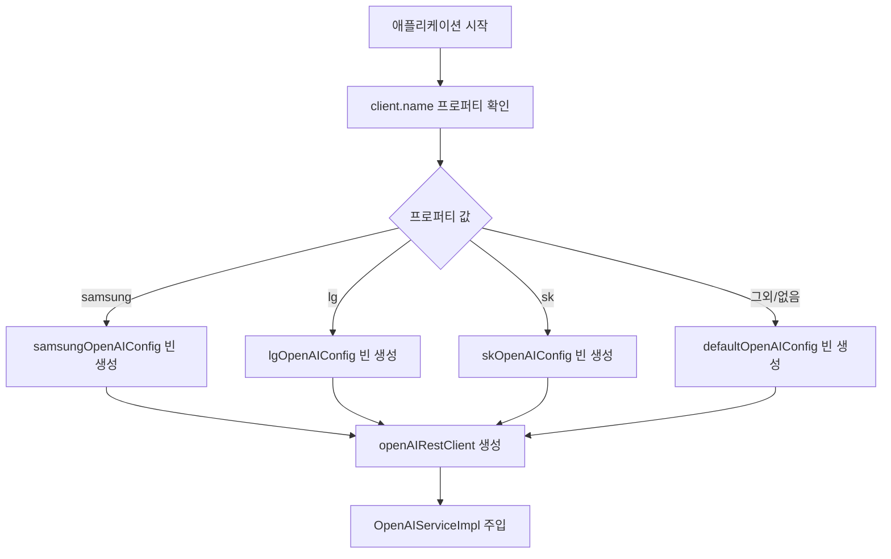

# 클라이언트별 조건부 설정 가이드

## 개요
`@ConditionalOnProperty`를 사용하여 클라이언트별로 다른 OpenAI 설정을 **조건부로** 로드하는 방식입니다.

## @Conditional 방식이란?

Spring Boot의 **조건부 빈 등록** 메커니즘을 활용하여, 특정 조건이 만족될 때만 빈을 생성하는 방식입니다.

### 부트스트래핑 vs @Conditional 비교

| 구분 | 부트스트래핑 | @Conditional |
|------|-------------|-------------|
| **복잡도** | 높음 | 낮음 |
| **가독성** | 어려움 | 쉬움 |
| **디버깅** | 어려움 | 쉬움 |
| **Spring 네이티브** | 아니오 | **예** |
| **테스트** | 어려움 | 쉬움 |
| **유지보수** | 어려움 | **쉬움** |

## 구현 아키텍처

### 핵심 컴포넌트

#### `OpenAIConfiguration`
```kotlin
@Configuration
class OpenAIConfiguration {

    @Bean
    @ConditionalOnProperty(name = "client.name", havingValue = "samsung")
    fun samsungOpenAIConfig(environment: Environment): OpenAIConfig {
        return createClientConfig("samsung", "gpt-4-turbo", environment)
    }

    @Bean
    @ConditionalOnProperty(name = "client.name", havingValue = "lg")
    fun lgOpenAIConfig(environment: Environment): OpenAIConfig {
        return createClientConfig("lg", "gpt-3.5-turbo", environment)
    }

    @Bean
    @ConditionalOnMissingBean  // 폴백
    fun defaultOpenAIConfig(environment: Environment): OpenAIConfig {
        return OpenAIConfig(...)
    }
}
```

### 빈 선택 플로우



## 사용 방법

### 1. 클라이언트별 실행

#### 삼성 클라이언트
```bash
./gradlew bootRun --args='--spring.profiles.active=samsung'
# 또는
./gradlew bootRun --args='--client.name=samsung'
```

#### LG 클라이언트
```bash
./gradlew bootRun --args='--spring.profiles.active=lg'
# 또는
./gradlew bootRun --args='--client.name=lg'
```

#### 기본 환경
```bash
./gradlew bootRun  # client.name이 없으면 기본 설정 사용
```

### 2. 환경변수 사용
```bash
# 삼성 전용 API 키
SAMSUNG_OPENAI_API_KEY=sk-samsung-real-key ./gradlew bootRun --args='--client.name=samsung'

# LG 전용 API 키
LG_OPENAI_API_KEY=sk-lg-real-key ./gradlew bootRun --args='--client.name=lg'
```

## 설정 우선순위

각 클라이언트별로 다음 순서로 설정값을 찾습니다:

1. **프로퍼티**: `clients.{client}.openai.api-key`
2. **환경변수**: `{CLIENT}_OPENAI_API_KEY`
3. **기본값**: `{client}-mock-key`

### 예시 - Samsung 클라이언트
```yaml
# application.yml에서
clients:
  samsung:
    openai:
      api-key: "설정파일의 키"  # 1순위

# 환경변수
SAMSUNG_OPENAI_API_KEY="환경변수의 키"  # 2순위

# 코드 기본값
"samsung-mock-key"  # 3순위
```

## 클라이언트별 특징

### Samsung
- **모델**: `gpt-4-turbo`
- **포트**: `8080`
- **조건**: `client.name=samsung`

### LG
- **모델**: `gpt-3.5-turbo`
- **포트**: `8081`
- **조건**: `client.name=lg`

### SK
- **모델**: `gpt-4`
- **포트**: `8082`
- **조건**: `client.name=sk`

### Default
- **모델**: `gpt-4`
- **포트**: `8080`
- **조건**: `@ConditionalOnMissingBean` (다른 빈이 없을 때)

## 새 클라이언트 추가하기

### Step 1: OpenAIConfiguration에 빈 추가
```kotlin
@Bean
@ConditionalOnProperty(name = "client.name", havingValue = "hyundai")
fun hyundaiOpenAIConfig(environment: Environment): OpenAIConfig {
    return createClientConfig("hyundai", "gpt-4", environment)
}
```

### Step 2: application.yml에 프로파일 추가
```yaml
---
spring.config.activate.on-profile: hyundai

client:
  name: hyundai

clients:
  hyundai:
    openai:
      api-key: ${HYUNDAI_OPENAI_API_KEY:sk-hyundai-key}
      model: gpt-4

server:
  port: 8083
```

### Step 3: 실행 & 테스트
```bash
./gradlew bootRun --args='--spring.profiles.active=hyundai'
```

## 장점

### ✅ 개발 생산성
- **간단한 구조**: 복잡한 부트스트래핑 로직 불필요
- **명확한 조건**: `@ConditionalOnProperty`로 조건이 명확
- **Spring 표준**: Spring Boot의 표준 방식

### ✅ 유지보수성
- **가독성**: 각 클라이언트별 빈이 명확히 분리
- **디버깅**: Spring Boot Actuator로 어떤 빈이 로드되었는지 확인 가능
- **테스트**: 조건별로 쉽게 단위 테스트 작성 가능

### ✅ 운영 편의성
- **로그**: 어떤 조건으로 빈이 생성되었는지 로그로 확인
- **모니터링**: Spring Boot Admin으로 빈 상태 모니터링
- **문제해결**: 조건부 로직이 명확해 문제 원인 파악 쉬움

## 테스트 예시

### 단위 테스트
```kotlin
@TestPropertySource(properties = ["client.name=samsung"])
@SpringBootTest
class SamsungConfigTest {

    @Autowired
    lateinit var openAIConfig: OpenAIConfig

    @Test
    fun `삼성 클라이언트 설정이 로드되는지 확인`() {
        assertThat(openAIConfig.model).isEqualTo("gpt-4-turbo")
    }
}
```

### 통합 테스트
```kotlin
@SpringBootTest
class ConditionalConfigIntegrationTest {

    @Test
    fun `client_name이 없으면 기본 설정 사용`() {
        // given: client.name 프로퍼티 없음

        // when: 애플리케이션 시작

        // then: defaultOpenAIConfig 빈이 생성됨
    }
}
```

## 모니터링 & 디버깅

### 어떤 빈이 로드되었는지 확인
```bash
# 애플리케이션 실행 후
curl http://localhost:8080/actuator/beans | jq '.contexts.application.beans | keys | map(select(contains("OpenAI")))'
```

### 조건 평가 결과 확인
```yaml
# application.yml
logging:
  level:
    org.springframework.boot.autoconfigure.condition: DEBUG
```

이제 **더 간단하고 Spring스러운** 방식으로 클라이언트별 설정을 관리할 수 있습니다!